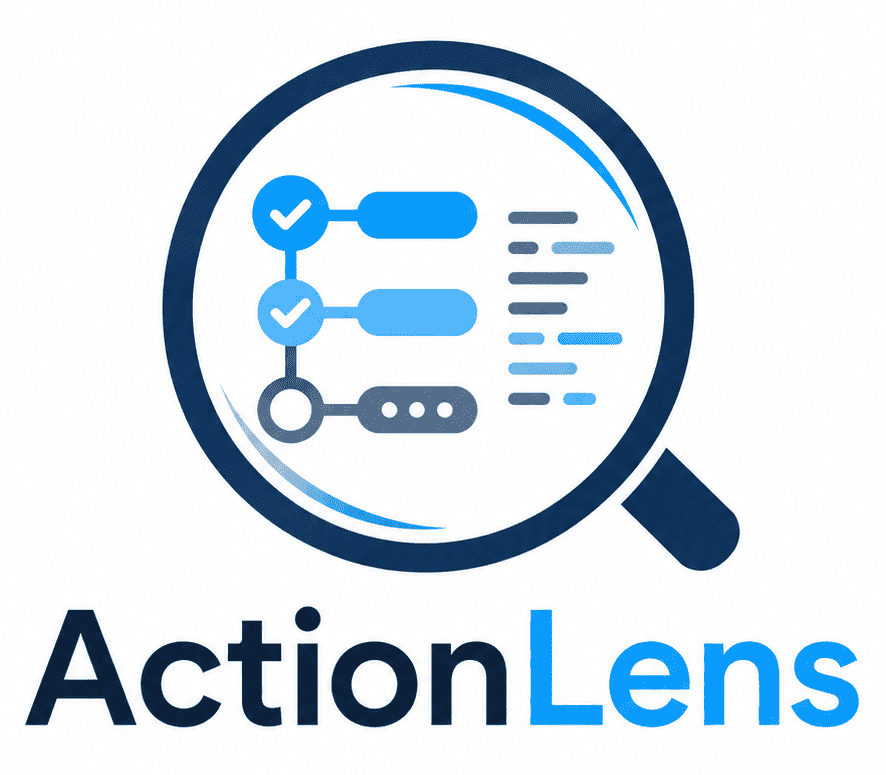
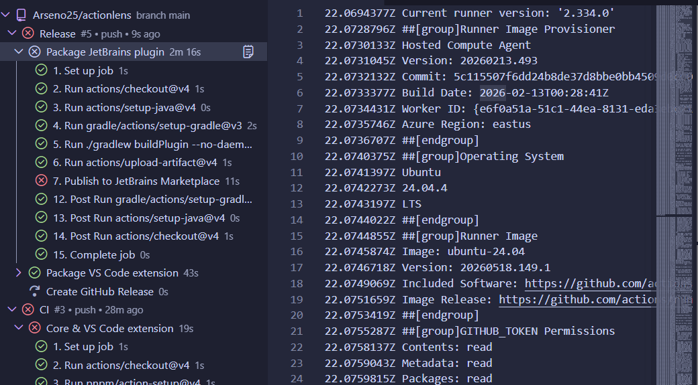
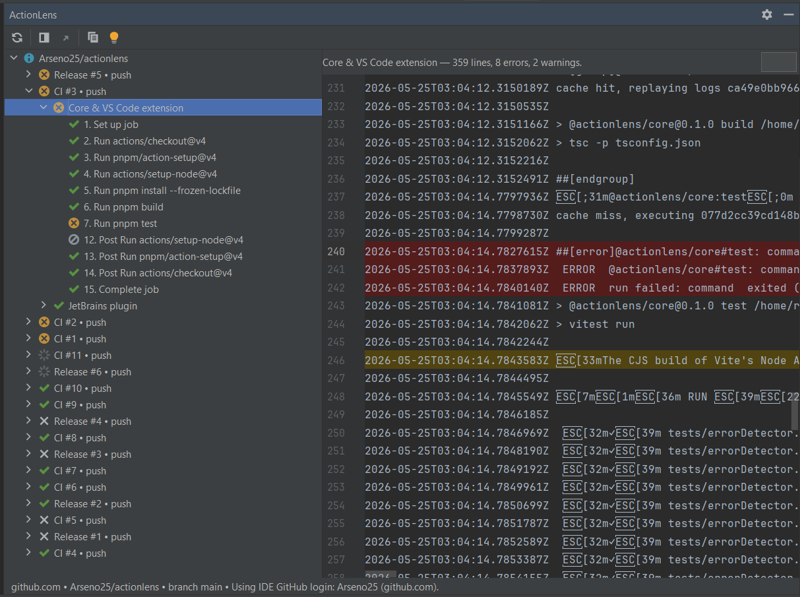

<div align="center">
  
  <h1>ActionLens</h1>
  <p><b>GitHub Actions inspector that lives inside your IDE.</b></p>
</div>

View workflow runs, jobs, steps, and full job logs with error highlighting — without leaving VS Code or your JetBrains IDE.

> Status: MVP scaffold. The shared core, VS Code extension, and JetBrains
> plugin compile and run; see [Known limitations](#known-limitations).

## Why

Most IDE-side GitHub Actions integrations stop at run status. When something
fails you still have to open the browser to read the logs. ActionLens shows the
full logs in-IDE, highlights the lines that likely caused the failure, and
gives you one-click commands to copy a clean error snippet or an AI-ready
debug prompt.

## Features

- Detects the GitHub repository from your workspace's `origin` remote
- Lists workflow runs filtered by branch, commit, status, conclusion, or
  workflow name
- Drill down: run → jobs → steps
- Streams job logs into a read-only editor with error-line highlighting
- Search/filter inside logs
- Commands: `Refresh`, `Open in GitHub`, `Copy Error Snippet`,
  `Copy AI Debug Prompt`
- Auto-refresh for in-progress runs (optional)
- Token stored securely (VS Code `SecretStorage` / JetBrains `PasswordSafe`)

## Screenshots

### VS Code Extension


### JetBrains Plugin


## Repository layout

```
actionlens/
  packages/
    core/                  # shared TypeScript logic (IDE-agnostic)
    vscode-extension/      # VS Code extension
    jetbrains-plugin/      # JetBrains plugin (Kotlin + Gradle)
  docs/                    # architecture, security, roadmap
```

See [`docs/ARCHITECTURE.md`](docs/ARCHITECTURE.md) for a detailed overview.

## Installation

### VS Code (from source)

```bash
pnpm install
pnpm --filter @actionlens/core build
pnpm --filter actionlens-vscode build
# Open packages/vscode-extension in VS Code, press F5 to launch the
# Extension Development Host.
```

### JetBrains plugin (from source)

```bash
cd packages/jetbrains-plugin
./gradlew runIde       # macOS / Linux
gradlew.bat runIde     # Windows
```

This launches a sandbox IDE with ActionLens installed.

## GitHub token permissions

ActionLens needs read access to Actions for the repositories you want to
inspect.

| Token type        | Scope / permission                                   |
| ----------------- | ---------------------------------------------------- |
| Fine-grained PAT  | Repository → **Actions: Read-only**                  |
| Classic PAT       | `repo` (private repos) — public-only: no scope       |
| GitHub OAuth (VS Code) | Default scopes from `vscode.authentication`     |

In VS Code, ActionLens prefers `vscode.authentication.getSession('github')`
and falls back to a manual token (stored in `SecretStorage`). In JetBrains,
tokens are stored in `PasswordSafe`.

## Usage

### VS Code

1. Open a project whose `origin` points at GitHub.
2. Open the **ActionLens** sidebar.
3. If the repo is private, run `ActionLens: Configure Token` (or sign in via
   the GitHub authentication prompt).
4. Expand a run → job → step → click "Open Log".

### JetBrains

1. Open a project tracked by Git with a GitHub `origin`.
2. Open the **ActionLens** tool window (right-hand side by default).
3. Set your token in **Settings → Tools → ActionLens**.
4. Click refresh, expand a run, double-click a job to see its log.

## Development

```bash
# install
pnpm install

# build everything
pnpm build

# run unit tests for the core
pnpm test:core
```

### Working on the VS Code extension

```bash
pnpm --filter actionlens-vscode dev
```

Then press `F5` inside VS Code (with the `packages/vscode-extension` folder
open) to launch the Extension Development Host.

### Working on the JetBrains plugin

```bash
cd packages/jetbrains-plugin
./gradlew runIde
```

## Known limitations

- AI integration is **not** included. `Copy AI Debug Prompt` only copies a
  prompt to the clipboard; you paste it into the AI tool of your choice.
- "Rerun failed jobs" / "cancel workflow" are not wired up yet (the
  architecture is ready — see `docs/ROADMAP.md`).
- GitHub Enterprise Server is not enabled in MVP, but the API base URL is
  configurable in the core client.

## Contributing

PRs welcome. Please see `docs/ARCHITECTURE.md` and `docs/SECURITY.md` before
touching auth or networking code.

## License

MIT — see [`LICENSE`](LICENSE).
